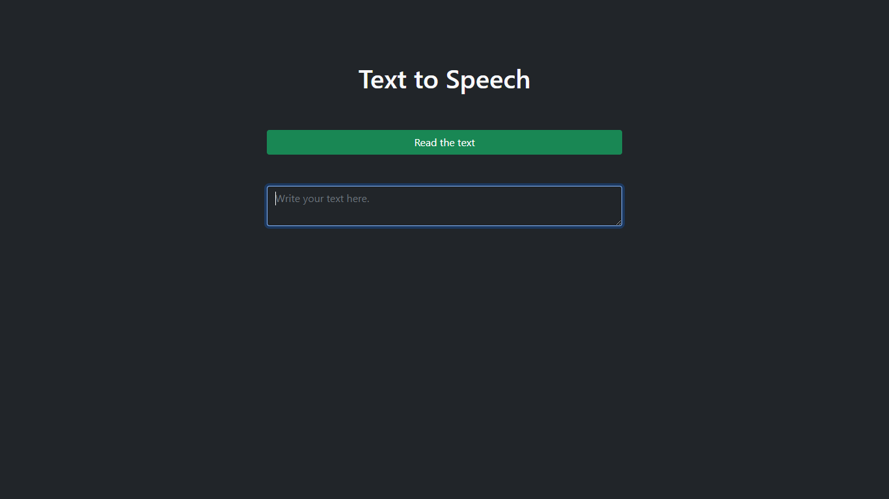
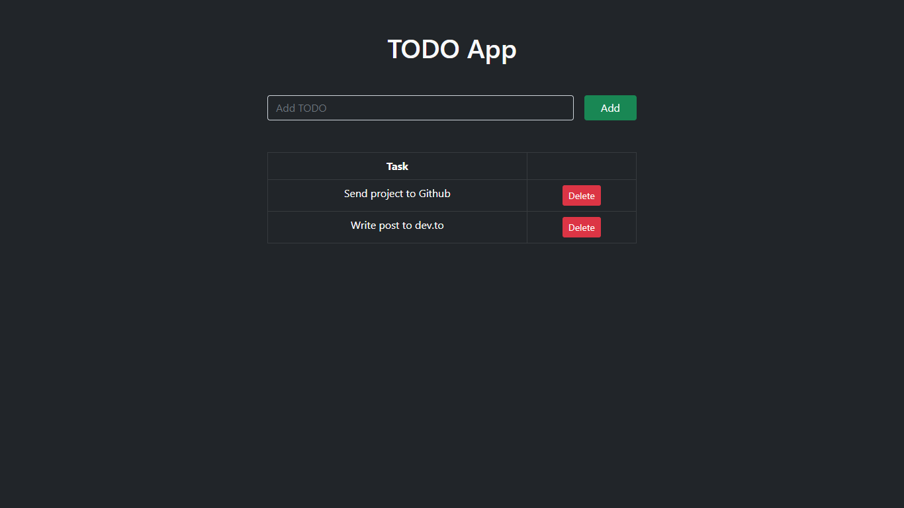
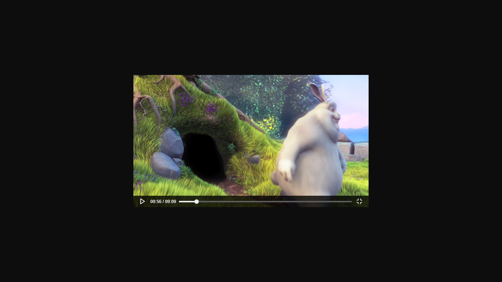

# JAVASCRIPT PROJECTS

Javascript sample projects for web developers.

## Content

* [Text to Speech](#speech)
* [Todo App - ES5 & ES6 - Local Storage](#todo-app)
* [Custom Video Player](#video-player)

 

### Text to Speech - [Back to top](#content)

 

### Todo App - ES5 & ES6 - Local Storage - [Back to top](#content)

 

### Video Player - [Back to top](#content)

 

